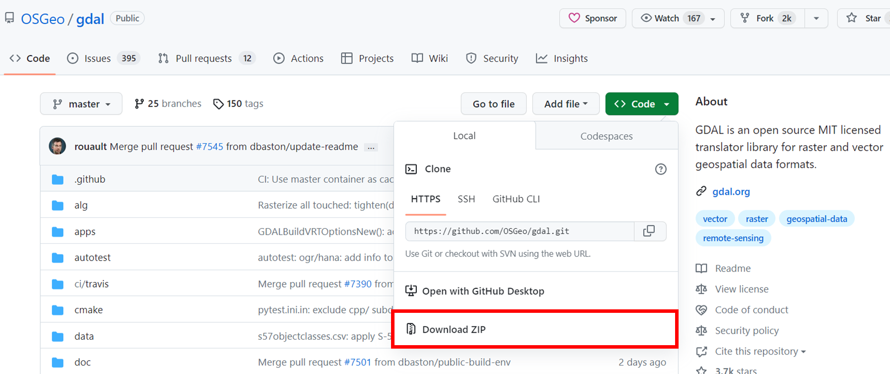

# Gdal environmental setup using Docker on Windows (medium)

# 1. Introduction

In this post, I will explain how to use GDAL (Geospatial Data Abstraction Library) on a Windows environment using Docker.

GDAL is an open-source library for handling geospatial data, and it supports many file formats. It can load, process, and transform spatial data such as maps, satellite images, and DEM (digital elevation model). It is widely used in fields that deal with geospatial information such as GIS and remote sensing.

In this article, I will first show you how to set up the environment using Docker and then convert DSM (Digital Surface Model) into point clouds. Finally, the point cloud is visualized using an online point cloud processing software, ScanX.

# 2. Prerequisite

## 2.1. Install Docker Desktop on Windows

- You can download it from the following link.
- Please ensure that WSL 2 is enabled.

## 2.2. Install the docker file for gdal

Access the following page to obtain the Docker file for setting up a gdal environment in Docker:

[https://github.com/OSGeo/gdal](https://github.com/OSGeo/gdal)

Click on the "Code" button in the upper right corner of the page, and a button that says "Download ZIP" as surrounded by the red box will appear. Please download the ZIP file from here.

After unzipping and extracting files in the ZIP file, you can find a file called `docker` inside the `gdal-master` folder.

Also, this time we will be using the `ubuntu-small` image.

For more information on the differences between these images, please refer to the following page:

[gdal/docker at master · OSGeo/gdal](https://github.com/OSGeo/gdal/tree/master/docker)

There is a Dockerfile inside `ubuntu-small`.

Execute the following command to build the Dockerfile:

`docker build -t gdalsmall .`

The option -t or --tag will help you out when running a docker image later.

Note that only lowercase characters are valid for the tag. The build process might take some time.

# 3. GDAL execution

## 3.1. Data preparation

The tif file used here is stored on the following page.

[run-gdal-using-docker-image-on-Windows/data at main · KentaItakura/run-gdal-using-docker-image-on-Windows](https://github.com/KentaItakura/run-gdal-using-docker-image-on-Windows/tree/main/data)

This data was downloaded from the following OpenTopography page and further converted to DSM (Digital Surface Model) using MATLAB. How to convert the point cloud into DSM is not mentioned in this post. 

[OpenTopography - Tuscaloosa, AL: Seasonal Inundation Dynamics And Invertebrate Communities](https://portal.opentopography.org/datasetMetadata?otCollectionID=OT.112011.26916.1)

Save the input.tif file downloaded from the GitHub page to the following location. However, if you adjust the command in section 3.3, you can save it anywhere.

## 3.2. **Execute Docker Desktop**

Start Docker Desktop.

## 3.3. Run gdal in Docker

Run gdal with the following script. 

`docker run --rm -it -v D:\blog\202303_gdal\data:/home --name gdal -t gdalsmall`

Use the docker `--rm` option to automatically remove the container when you finish using gdal.

The following command is important. It allows you to see the folder on your PC (here, `D:\blog\202303_gdal\data`) within the `/home` folder in the docker environment.

`-v D:\blog\202303_gdal\data:/home`

Also, the following example shows an instance where you move to the home directory using `cd home` and confirm the files within that folder using the `ls` command. I was able to confirm the target files in my data folder.

## 3.4. Investigate the tif file

`gdalinfo` ists information about a raster dataset.

Move the path first. 

`cd home`

Then, run gdalinfo as below. 

`gdalinfo input.tif`

Information on the tif file like coordinate system is shown like below. 

According to the documentation, the gdalinfo will report all of the following (if known):

- The format driver used to access the file.
- Raster size (in pixels and lines).
- The coordinate system for the file (in OGC WKT).
- The geotransform associated with the file (rotational coefficients are currently not reported).
- Corner coordinates in georeferenced, and if possible lat/long based on the full geotransform (but not GCPs).
- Ground control points.
- File wide (including subdatasets) metadata.
- Band data types.
- Band color interpretations.
- Band block size.
- Band descriptions.
- Band min/max values (internally known and possibly computed).
- Band checksum (if computation asked).
- Band NODATA value.
- Band overview resolutions available.
- Band unit type (i.e.. “meters” or “feet” for elevation bands).
- Band pseudo-color tables.

[gdalinfo — GDAL  documentation](https://gdal.org/programs/gdalinfo.html)

## 3.5. Convert Digital Surface Model (DSM) into point cloud (.xyz)

Please convert the DSM into point cloud using the following command. 

`gdal_translate -of XYZ input.tif pointcloud.xyz`

With this command, you can save the point cloud file generated from the tif file in the xyz format.

In addition, using GDAL, you can perform various operations and processes.

For more information on other GDAL options, please refer to the following documentation.

[Programs — GDAL  documentation](https://gdal.org/programs/index.html)

# 4. Visualizating the point cloud in ScanX

Let's visualize the 3D point cloud generated in version 3.5. Here, we will use ScanX, an online point cloud processing software. Please refer to the following page for more information on ScanX.

[Online Point Cloud Processing Software | ScanX](https://global.scanx.jp/)

While I will not go into detail about how to upload a point cloud, the following settings are recommended when uploading the file:

**Scanner type**: UAV LiDAR 

**Area type**: Urban or Rural 

Also, when setting coordinates, please enter the EPSG code `26916`.

After configuring the above settings, please upload the point cloud. After a while, the project creation will be complete.

The following video shows a visualization of the point cloud converted from DSM, which is shown in ScanX. 

At first, it represents the elevation information. Additionally, ScanX can automatically classify point clouds. By switching the right tab from “`Elevataion`” to "`Classification`," you can confirm the classification information of each point.

The ground surface is brown, vegetation is green, and buildings are shown in orange.

For example, the building in front is neatly painted in orange, indicating that it has been classified successfully.

Additionally, as you can see in the following figure, only the ground surface of the earth is extracted by specifiying the class to be shown in ScanX.

# 5. Summary

In this post, I explained how to use GDAL to convert DSM to a 3D point cloud. I set up the environment using Docker on Windows, then uploaded the obtained point cloud to the online point cloud processing software ScanX to visualized it.

GDAL has many functions such as loading spatial data in other formats and processing and converting them. I would like to continue to try out the functions of GDAL in the future.

The data and manuscript used in this post are stored on the following page. Please download and check them out.

[https://github.com/KentaItakura/run-gdal-using-docker-image-on-Windows](https://github.com/KentaItakura/run-gdal-using-docker-image-on-Windows)